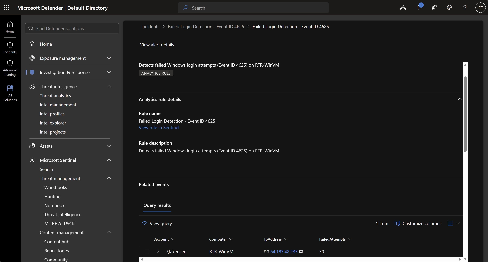
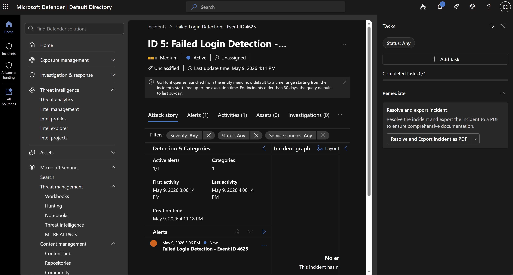
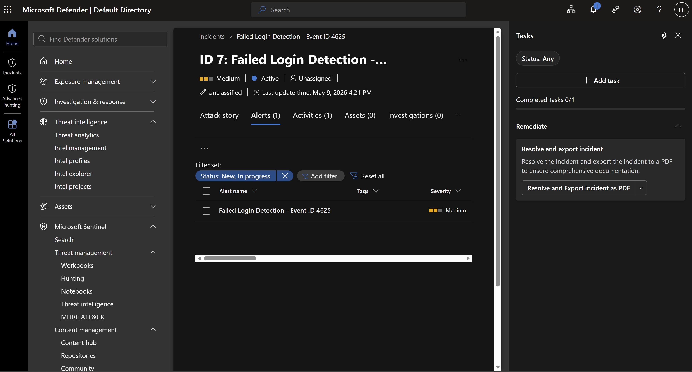
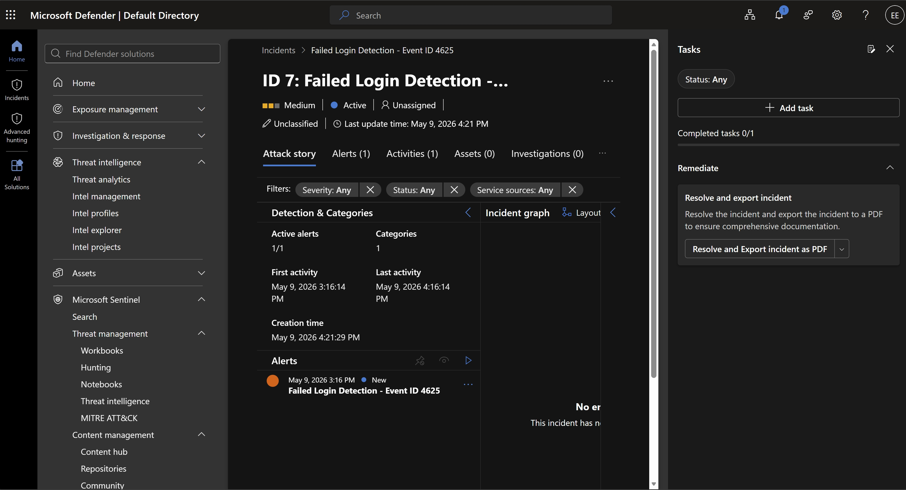

# SOC Lab 27 — Microsoft Sentinel: Cloud SIEM Detection

## Table of Contents
1. [Executive Summary](#executive-summary)
2. [Incident Ticket (ServiceNow Simulation)](#incident-ticket-servicenow-simulation)
3. [Lab Objectives](#lab-objectives)
4. [Environment Overview](#environment-overview)
5. [Data Pipeline Configuration](#data-pipeline-configuration)
6. [Log Ingestion Verification](#log-ingestion-verification)
7. [Detection Rule Engineering](#detection-rule-engineering)
8. [Attack Simulation](#attack-simulation)
9. [Incident Investigation](#incident-investigation)
10. [MITRE ATT&CK Mapping](#mitre-attck-mapping)
11. [Evidence](#evidence)
12. [Conclusions](#conclusions)
13. [Next Steps](#next-steps)

---

## Executive Summary

This lab deploys Microsoft Sentinel as a cloud-native SIEM in Azure and validates the complete detection pipeline — from log ingestion through incident investigation. A Windows Server 2025 virtual machine (RTR-WinVM) was configured to forward Windows Security Events to a Log Analytics Workspace via the Azure Monitor Agent (AMA) and a Data Collection Rule (DCR). A custom KQL scheduled query rule was written to detect failed login attempts (Event ID 4625). A brute force attack was simulated via RDP using invalid credentials, generating 30 failed logon events. Microsoft Sentinel triggered 7 incidents in the Microsoft Defender XDR portal, all confirmed as Medium severity with the source account, target machine, and attacker IP identified.

This lab demonstrates the complete cloud SOC detection pipeline used in enterprise security operations: log collection, detection engineering, alert triage, and incident investigation using the Microsoft security stack.

---

## Incident Ticket (ServiceNow Simulation)

| Field | Details |
|---|---|
| **Incident ID** | INC-0027 |
| **Date/Time Detected** | 2026-05-09 16:11 UTC |
| **Detected By** | Eric Ellison — SOC Analyst |
| **Severity** | Medium |
| **Category** | Credential Access |
| **Subcategory** | Brute Force / Failed Logon |
| **Short Description** | Microsoft Sentinel detected 30 failed Windows login attempts against RTR-WinVM from IP 64.183.42.233 |
| **Detailed Description** | A scheduled KQL analytic rule in Microsoft Sentinel detected repeated failed Windows login attempts (Event ID 4625) against RTR-WinVM. The rule ran on a 5-minute schedule with a 1-hour lookback window and a threshold of 5 or more failed attempts grouped by account, computer, and IP address. Query results identified account .\fakeuser generating 30 failed attempts from external IP 64.183.42.233 via RDP. Seven incidents were generated in the Microsoft Defender XDR incident queue across the detection window. All incidents confirmed Medium severity and Active status. |
| **IOCs** | Account: .\fakeuser — Computer: RTR-WinVM — Source IP: 64.183.42.233 — Failed Attempts: 30 — Event ID: 4625 |
| **Impact Assessment** | Low — lab environment. In production, 30 failed RDP login attempts from an external IP against a local account would represent an active brute force attack requiring immediate containment. |
| **Response Actions Taken** | Incidents reviewed in Microsoft Defender XDR. Alert details confirmed. IOCs documented. Containment recommendations identified. |
| **Recommended Actions** | Block IP 64.183.42.233 at NSG level. Disable public RDP exposure. Enable account lockout policy. Enforce MFA for all RDP-accessible accounts. Restrict RDP to Azure Bastion or VPN. |
| **Status** | Closed — Lab Complete |

---

## Lab Objectives

- Deploy Microsoft Sentinel in Azure connected to a Log Analytics Workspace
- Configure a Windows VM to forward Security Events via the Azure Monitor Agent (AMA)
- Verify log ingestion by querying the SecurityEvent table in Log Analytics
- Write a custom KQL scheduled query rule to detect failed login attempts (Event ID 4625)
- Simulate a brute force attack via RDP to generate real telemetry
- Investigate the resulting incidents in Microsoft Defender XDR
- Document findings in incident report format for portfolio

---

## Environment Overview

| Component | Details |
|---|---|
| **SIEM Platform** | Microsoft Sentinel |
| **Security Portal** | Microsoft Defender XDR (security.microsoft.com) |
| **Log Analytics Workspace** | RTR-LAW (West US 2) |
| **Workspace ID** | e58d0565-bcf4-43b7-820a-07e86fdab056 |
| **Virtual Machine** | RTR-WinVM |
| **OS** | Windows Server 2025 Datacenter x64 |
| **VM Size** | Standard_D2s_v3 (2 vCPUs, 8 GiB) |
| **VM Region** | East US |
| **VM Public IP** | 20.127.82.236 |
| **Data Connector** | Windows Security Events via AMA |
| **Data Collection Rule** | rtr-dcr-windowsevents |
| **Resource Group** | rtr-sentinel-lab |
| **Azure Subscription** | Azure Subscription 1 (Pay-As-You-Go) |
| **Query Language** | KQL (Kusto Query Language) |

---

## Data Pipeline Configuration

The data pipeline was configured to forward Windows Security Events from RTR-WinVM into Microsoft Sentinel via the following components:

### Azure Monitor Agent (AMA)
The Azure Monitor Agent was deployed on RTR-WinVM via the Windows Security Events data connector in Microsoft Sentinel. The AMA replaced the legacy Microsoft Monitoring Agent (MMA) and provides the current supported method for Windows event log collection.

### Data Collection Rule (DCR)
A Data Collection Rule named **rtr-dcr-windowsevents** was created to define what data to collect and where to send it.

| DCR Property | Value |
|---|---|
| Name | rtr-dcr-windowsevents |
| Platform Type | Windows |
| Data Sources | Windows Event Logs |
| Destination | Azure Monitor Logs (RTR-LAW) |
| Connected Resources | RTR-WinVM (East US) |
| Tag | createdBy: Sentinel |

### Data Flow

```
RTR-WinVM (Windows Server 2025)
    → Azure Monitor Agent (AMA)
        → Data Collection Rule (rtr-dcr-windowsevents)
            → Log Analytics Workspace (RTR-LAW)
                → Microsoft Sentinel
                    → Microsoft Defender XDR
```

---

## Log Ingestion Verification

Before creating the detection rule, log ingestion was verified by querying the SecurityEvent table directly in Log Analytics using KQL.

### Verification Query

```kql
SecurityEvent
| take 10
```

### Result

10 events returned from RTR-WinVM with timestamps matching the current session. Events included accounts WORKGROUP\RTR-WinVM$ and NT AUTHORITY\SYSTEM — confirming end-to-end connectivity from the VM through AMA, DCR, and into the Log Analytics workspace.

---

## Detection Rule Engineering

### Rule Configuration

A scheduled query analytic rule was created in Microsoft Sentinel (via the Microsoft Defender XDR portal) to detect brute force login attempts using Event ID 4625.

| Rule Property | Value |
|---|---|
| **Rule Name** | Failed Login Detection — Event ID 4625 |
| **Rule Type** | Scheduled Query Rule |
| **Description** | Detects failed Windows login attempts (Event ID 4625) on RTR-WinVM |
| **Severity** | Medium |
| **Status** | Enabled |
| **MITRE Tactic** | Credential Access (TA0006) |
| **MITRE Technique** | T1110 — Brute Force |
| **Query Frequency** | Every 5 minutes |
| **Lookback Period** | Last 1 hour |
| **Alert Threshold** | Is greater than 0 |
| **Event Grouping** | Group all events into a single alert |

### KQL Detection Query

```kql
SecurityEvent
| where EventID == 4625
| where TimeGenerated > ago(1h)
| summarize FailedAttempts = count() by Account, Computer, IpAddress
| where FailedAttempts >= 5
```

**Query Logic:**
- Filters the SecurityEvent table for Event ID 4625 (failed logon)
- Limits scope to the last 1 hour
- Groups failed attempts by account, computer, and source IP
- Alerts when any combination exceeds 5 failed attempts — consistent with brute force behavior

---

## Attack Simulation

A brute force login simulation was performed against RTR-WinVM via RDP to generate real Event ID 4625 telemetry.

### Simulation Parameters

| Parameter | Value |
|---|---|
| **Target Machine** | RTR-WinVM |
| **Target IP** | 20.127.82.236 |
| **Protocol** | RDP (Port 3389) |
| **Tool** | mstsc (Remote Desktop Connection) |
| **Simulated Username** | fakeuser |
| **Simulated Password** | [intentionally incorrect] |
| **Manual Attempts** | 10 RDP connection attempts |
| **Total Events Detected** | 30 Event ID 4625 entries (within 1-hour lookback) |

### Simulation Steps

1. Opened Remote Desktop Connection (mstsc) on local machine
2. Connected to 20.127.82.236 (RTR-WinVM public IP)
3. Entered username `fakeuser` and an incorrect password at the Windows Security prompt
4. Each failed attempt generated one or more Event ID 4625 entries in the Windows Security Event Log
5. Events forwarded to RTR-LAW via AMA and rtr-dcr-windowsevents DCR
6. Repeated 10 times to generate sufficient volume for rule detection

---

## Incident Investigation

### Incident Queue

Following the simulation, Microsoft Sentinel's analytic rule triggered and generated incidents in the Microsoft Defender XDR incident queue.

| Property | Value |
|---|---|
| **Total Incidents Generated** | 7 |
| **Incident ID (Latest)** | 7 |
| **Alert Name** | Failed Login Detection — Event ID 4625 |
| **Severity** | Medium |
| **Status** | Active |
| **Active Alerts** | 1/1 |
| **First Activity** | May 9, 2026 — 3:06:14 PM UTC |
| **Last Activity** | May 9, 2026 — 4:06:14 PM UTC |
| **Incident Created** | May 9, 2026 — 4:11:18 PM UTC |

### Alert Query Results — IOCs Identified

| Field | Value | Notes |
|---|---|---|
| **Account** | .\fakeuser | Local non-existent account — enumeration attempt |
| **Computer** | RTR-WinVM | Target machine |
| **Source IP** | 64.183.42.233 | External IP — attacker origin |
| **FailedAttempts** | 30 | Well above threshold — confirmed brute force pattern |
| **Event ID** | 4625 | Windows Security: An account failed to log on |

### Incident Timeline

| Time (UTC) | Event |
|---|---|
| May 9, 2026 3:06 PM | First failed login attempt recorded on RTR-WinVM |
| May 9, 2026 3:16 PM | Sentinel analytic rule triggers — Incident ID 7 alert generated |
| May 9, 2026 4:06 PM | Last failed login attempt recorded |
| May 9, 2026 4:11 PM | Incident ID 5 created in Microsoft Defender XDR |
| May 9, 2026 4:21 PM | Incident ID 7 created — 7 total incidents in queue |
| May 9, 2026 4:34 PM | Alert details reviewed — 30 failed attempts confirmed |

### Analysis

The 30 failed login attempts from a single external IP (64.183.42.233) targeting a non-existent local account (fakeuser) on RTR-WinVM is consistent with an automated credential brute force pattern:

- High attempt volume in a compressed timeframe indicates automation
- Single source IP targeting one machine — targeted brute force, not distributed spray
- Account name 'fakeuser' does not exist on the system — attacker attempting account enumeration
- No successful logon (Event ID 4624) following the failures — access was not achieved
- RDP exposed on public IP — this is the attack surface

---

## MITRE ATT&CK Mapping

| Field | Value |
|---|---|
| **Tactic** | Credential Access (TA0006) |
| **Technique** | Brute Force (T1110) |
| **Sub-technique** | Password Guessing (T1110.001) |
| **Objective** | Gain unauthorized RDP access to RTR-WinVM |

### Containment Recommendations

- Block source IP 64.183.42.233 at the Azure Network Security Group (NSG) level
- Disable public RDP exposure on port 3389 — restrict to Azure Bastion or VPN only
- Enable account lockout policy after 5 failed attempts via Group Policy
- Enable MFA for all accounts with RDP access
- Sweep other machines for login attempts from the same source IP
- Review Azure Activity Log for unauthorized resource modifications from the source IP
- Escalate to Tier 2 if lateral movement or additional IOCs are identified

---

## Evidence

All screenshots are stored in this repository.

| File | Description |
|---|---|
| screenshot_alert_details_fakeuser.png | Alert details showing fakeuser, RTR-WinVM, IP 64.183.42.233, 30 failed attempts |
| screenshot_id_5_alert_details_fakeuser.png | Incident ID 5 overview — Attack story tab |
| screenshot_id_7_alerts_tab.png | Incident ID 7 — Alerts tab showing Failed Login Detection alert |
| screenshot_id_7_failed_login_detection.png | Incident ID 7 — Attack story tab with activity timeline |






---

## Conclusions

- Microsoft Sentinel successfully ingested Windows Security Events from RTR-WinVM via AMA and the rtr-dcr-windowsevents DCR
- KQL query using EventID 4625 with summarize and threshold filtering effectively surfaced brute force activity while reducing noise
- The 5-minute scheduled rule with 1-hour lookback provided near real-time detection — incidents appeared in Defender XDR within minutes of the simulation
- Microsoft Defender XDR consolidates Sentinel incidents with broader XDR telemetry — this integration mirrors enterprise SOC architecture
- 7 incidents generated — all Medium severity — confirming the detection rule fired correctly across multiple rule cycles
- IOCs successfully identified: account name, target machine, source IP, and failed attempt count
- Public RDP exposure is a critical attack surface — this lab demonstrates exactly why it must be restricted in production environments

---

## Next Steps

- Lab 28: Vulnerability Scanning — Nessus Essentials or OpenVAS
- Add Microsoft Sentinel to resume skills table
- Begin Python scripting lab for basic security automation
- Study for CompTIA Security+
